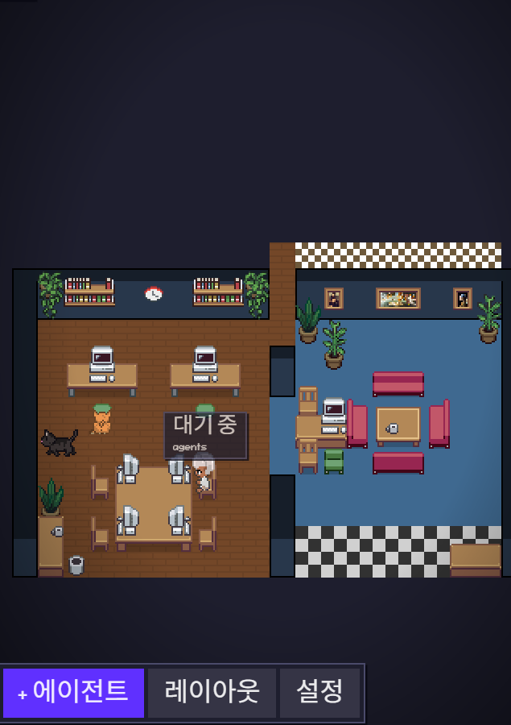

# 작업 보고서 — 2026-06-26

## 개요



**OpenCode 프로바이더 통합** — pixel-agents가 Claude Code 외에 OpenCode(Bun 기반 AI 코딩 에이전트)를 두 번째 훅 프로바이더로 지원하도록 다중 프로바이더 아키텍처를 구현했습니다.

---

## 변경 파일 목록

| 파일                                                           | 상태 |
| -------------------------------------------------------------- | ---- |
| `server/src/providers/hook/opencode/opencode.ts`               | 신규 |
| `server/src/providers/hook/opencode/opencodeHookInstaller.ts`  | 신규 |
| `server/src/providers/hook/opencode/constants.ts`              | 신규 |
| `server/src/providers/hook/opencode/hooks/opencode-plugin.mjs` | 신규 |
| `server/src/providers/index.ts`                                | 수정 |
| `server/src/hookEventHandler.ts`                               | 수정 |
| `server/src/agentRuntime.ts`                                   | 수정 |
| `server/src/fileWatcher.ts`                                    | 수정 |
| `server/src/cli.ts`                                            | 수정 |
| `adapters/vscode/PixelAgentsViewProvider.ts`                   | 수정 |
| `esbuild.js`                                                   | 수정 |

---

## 주요 작업 내용

### 1. OpenCode 프로바이더 구현 (`server/src/providers/hook/opencode/`)

기존 Claude 프로바이더와 동일한 `HookProvider` 인터페이스를 구현하는 새 프로바이더 디렉터리를 생성했습니다.

#### `opencode.ts` — HookProvider 구현

- **`normalizeHookEvent()`**: OpenCode 플러그인이 POST하는 페이로드를 표준 `AgentEvent` 유니온으로 변환
  - `ToolBefore` → `toolStart`
  - `ToolAfter` → `toolEnd`
  - `SessionIdle` → `turnEnd`
  - `SessionCreated` → `sessionStart`
  - `SessionDeleted` → `sessionEnd`
  - `PermissionAsked` → `permissionRequest`
- **`formatToolStatus()`**: OpenCode의 소문자 snake_case 툴 이름(`read`, `write`, `bash`, `glob`, `grep`, `fetch` 등)을 UI 표시 텍스트로 변환
- **`permissionExemptTools`**: `task`, `agent`, `computer` — 권한 타이머를 발동시키지 않는 툴 목록
- **`subagentToolNames`**: `task`, `agent`
- **`readingTools`**: `read`, `read_file`, `glob`, `list_files`, `find_files`, `grep`, `search_files`, `fetch` 등
- **`getAllSessionRoots()`**: 스테일 체크 스캐너를 위한 OpenCode 세션 디렉터리 경로 제공 (`~/.local/share/opencode/storage` 또는 Windows `%LOCALAPPDATA%\opencode\storage`)
- **`buildLaunchCommand()`**: `opencode run --session <sessionId>` 명령 반환

#### `opencodeHookInstaller.ts` — 플러그인 설치/제거

- OpenCode 설정 파일(`~/.config/opencode/opencode.json`)의 `plugin[]` 배열에 플러그인 경로를 등록/제거
- **`installHooks()`**: `~/.pixel-agents/hooks/opencode-plugin.mjs` 경로를 설정에 추가 (멱등성 보장 — 기존 항목 제거 후 재추가)
- **`uninstallHooks()`**: 설정에서 pixel-agents 플러그인 항목 제거
- **`areHooksInstalled()`**: 플러그인 파일 존재 여부 + 설정 등록 여부 확인
- **`copyPluginFile()`**: 익스텐션 번들(`dist/hooks/opencode-plugin.mjs`)을 `~/.pixel-agents/hooks/`로 복사
- 레거시 `"plugins"` 키(구버전 설치) 자동 정리
- 설정 파일 쓰기는 tmp 파일 → rename 방식으로 원자적 처리

#### `hooks/opencode-plugin.mjs` — OpenCode 플러그인 스크립트 (Bun ESM)

- OpenCode 내부에서 Bun ESM 런타임으로 실행되는 플러그인
- `~/.pixel-agents/server.json`을 읽어 실행 중인 서버의 포트/토큰을 확인
- `http://127.0.0.1:{port}/api/hooks/opencode`로 표준화된 이벤트 페이로드를 POST
- 구독 이벤트: `tool.execute.before`, `tool.execute.after`, `session.created`, `session.deleted`, `session.idle`, `permission.asked`
- 세션 최초 툴 이벤트 시 합성 `SessionCreated` 이벤트 자동 발생 (OpenCode v1에 `session.created` 훅이 없을 경우 대비)
- 에러는 모두 무시 — 훅이 에이전트 동작을 절대 중단시키지 않도록 방어

---

### 2. 다중 프로바이더 아키텍처 (`agentRuntime.ts`, `hookEventHandler.ts`)

기존 단일 프로바이더 구조를 여러 프로바이더를 동시에 처리할 수 있도록 확장했습니다.

#### `AgentRuntime` 생성자 변경

```typescript
// 이전
constructor(store, provider: HookProvider)

// 이후
constructor(store, provider: HookProvider, additionalProviders?: HookProvider[])
```

- 프라이머리 프로바이더 + 추가 프로바이더들을 `Map<providerId, HookProvider>`로 구성하여 `HookEventHandler`에 전달

#### `HookEventHandler` 프로바이더 라우팅

- `handleEvent(providerId, event)` — `_providerId`로 방치되던 파라미터를 실제로 활용
- `providerRegistry.get(providerId)`로 이벤트를 보낸 프로바이더를 조회하고, 해당 프로바이더의 `normalizeHookEvent()` / `formatToolStatus()`를 사용
- 알 수 없는 `providerId`는 프라이머리 프로바이더로 폴백하여 하위 호환성 유지

#### `registerWorkspaceDir()` 신규 메서드 (`agentRuntime.ts`)

- VS Code 워크스페이스 폴더를 추적 대상 디렉터리로 등록
- OpenCode처럼 JSONL 트랜스크립트가 없는 훅 전용 프로바이더의 세션을 Watch All Sessions 없이도 외부 세션으로 감지 가능

---

### 3. `fileWatcher.ts` — `registerTrackedDir()` 추가

```typescript
export function registerTrackedDir(dir: string): void {
  trackedProjectDirs.add(dir);
}
```

- JSONL 스캔을 시작하지 않고 디렉터리만 추적 목록에 등록
- 훅 전용 프로바이더(OpenCode)의 `cwd` 검증에 사용

---

### 4. VS Code 어댑터 통합 (`PixelAgentsViewProvider.ts`)

- `AgentRuntime` 생성 시 `opencodeProvider`를 두 번째 프로바이더로 전달
- 훅 활성화/비활성화 시 Claude + OpenCode 양쪽 모두 처리
- `providerCapabilities` 메시지: 두 프로바이더의 `readingTools`, `subagentToolNames`를 `Set` 합집합으로 머지하여 웹뷰에 전달
- 워크스페이스 폴더 활성화 시 `registerWorkspaceDir()` 호출 (모든 워크스페이스 폴더 대상)

---

### 5. CLI 통합 (`cli.ts`)

- `npx pixel-agents` 실행 시에도 동일하게 `opencodeProvider`를 등록
- 훅 설치/제거, 시작 시 자동 설치 로직에 OpenCode 포함

---

### 6. 빌드 시스템 (`esbuild.js`)

```
이전: Claude 훅 스크립트만 번들 (claude-hook.ts → claude-hook.js, CJS)

이후:
  - Claude 훅: 동일 (esbuild 번들, CJS)
  - OpenCode 플러그인: 번들 없이 파일 복사 (opencode-plugin.mjs → dist/hooks/, ESM 그대로)
```

OpenCode 플러그인은 Bun ESM 런타임에서 실행되므로 Node.js 번들링이 불필요합니다.

---

## 아키텍처 관점

### 설계 원칙 유지

- **HookProvider 인터페이스 무변경**: 기존 계약을 그대로 유지하며 구현체만 추가
- **런타임 무변경**: `AgentRuntime`은 `additionalProviders` 옵션 파라미터만 추가, 기존 동작 보존
- **단방향 의존성**: `providers/hook/opencode/`는 `core/`만 참조, 역방향 의존 없음
- **에러 격리**: 훅 스크립트에서 발생하는 모든 에러는 묵시적으로 처리 — 에이전트 동작 중단 방지

### 추가 프로바이더 온보딩 패턴

이번 작업으로 새 AI 에이전트 CLI를 추가하는 패턴이 명확해졌습니다:

```
server/src/providers/hook/<id>/
  <id>.ts                  # HookProvider 구현
  <id>HookInstaller.ts     # 설치/제거 로직
  constants.ts             # ID별 상수
  hooks/<id>-plugin.*      # 훅 스크립트 (런타임에 맞는 형식)
```

`AgentRuntime`, `HookEventHandler`, 웹뷰 UI, 프로토콜 계층은 수정 없이 새 프로바이더를 수용합니다.

---

## 남은 작업 / 후속 검토 사항

- [ ] OpenCode 프로바이더 서버 유닛 테스트 (`server/__tests__/`) 추가
- [ ] `hookEventHandler.ts`에 멀티 프로바이더 라우팅 테스트 추가
- [ ] OpenCode `session.created` 이벤트 지원 시 합성 이벤트 로직 제거
- [ ] `npm run package`로 `.vsix` 빌드 후 실제 OpenCode 환경에서 훅 설치/이벤트 수신 검증
- [ ] `e2e/README.md` 인벤토리 동기화 (`npm run e2e:inventory`)
